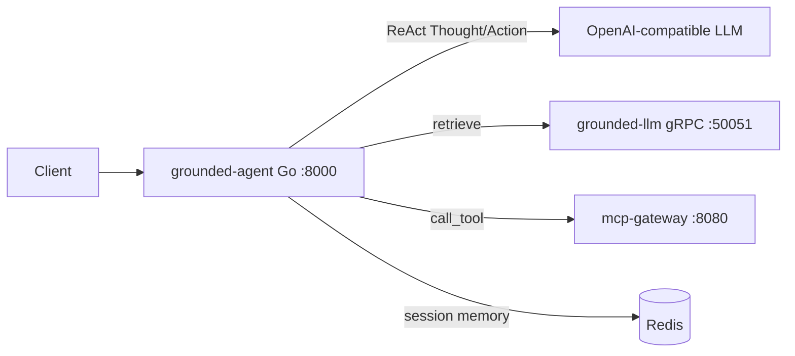

# Grounded Agent

[](https://github.com/kantik001/grounded-agent/actions/workflows/ci.yml)
[](go.mod)
[](LICENSE)

**ReAct orchestrator** that combines [Grounded LLM](https://github.com/kantik001/grounded-llm) retrieval with [MCP Gateway](https://github.com/kantik001/mcp-gateway) tools and Redis session memory.

> Document facts come from Grounded retrieval. Side effects and files go through MCP. The agent loop never replaces Grounded Spec verify — it consumes the same retrieval contract agents were designed for in Grounded LLM v0.3.

## Architecture



**Loop (max 5 steps):**

1. LLM emits `Thought:` + `Action:`
2. Action is one of:
   - `retrieve[query]` → Grounded gRPC / HTTP RAG
   - `call_tool[server.tool, {json}]` → MCP Gateway
   - `answer[text]` → done
3. Observation is appended; repeat until `answer` or step limit → `"I need more information"`

## Quick start

### Agent + Redis (default)

```bash
cp .env.example .env
# optional: set LLM_API_KEY for live LLM; without it use unit tests / mock retrieve
docker compose up --build -d
curl -s http://localhost:8000/health
```

Default `RETRIEVE_MODE=mock` so the agent boots without Grounded LLM.

### Full stack demo

Requires sibling clone of `mcp-gateway` at `../mcp-gateway` and GHCR access to Grounded LLM images:

```bash
# set LLM_API_KEY in .env
make docker-up-full
# or:
# docker compose -f docker-compose.yml -f docker-compose.full.yml --profile full up --build -d

curl -s -X POST http://localhost:8000/agent/chat \
  -H "Content-Type: application/json" \
  -d '{"query":"How many vacation days?","session_id":"demo-1"}'
```

The full override wires `RETRIEVE_MODE=grpc`, `GROUNDED_GRPC_ADDR=python:50051`, and builds MCP Gateway from the sibling repo.

### Local Go

```bash
cp .env.example .env
# RETRIEVE_MODE=mock for offline
go run ./cmd/server
```

```bash
curl -s -X POST http://localhost:8000/agent/chat \
  -H "Content-Type: application/json" \
  -d '{"query":"How many vacation days?","session_id":"abc123"}'
```

Repeat with the same `session_id` — Redis keeps the last 10 user/assistant pairs (TTL 30m).

## HTTP API

| Method | Path | Description |
|--------|------|-------------|
| `GET` | `/health` | Liveness |
| `GET` | `/metrics` | Prometheus (`agent_chat_*`, `agent_react_steps`, `agent_tool_calls_total`, `agent_retrieve_seconds`) |
| `POST` | `/agent/chat` | Run ReAct loop |

**Request**

```json
{
  "query": "How many vacation days?",
  "session_id": "abc123",
  "domain_id": "default",
  "tenant_id": "default",
  "locale": "en"
}
```

**Response**

```json
{
  "answer": "28 paid vacation days per year.",
  "steps": [
    {"thought": "...", "action": "retrieve", "observation": "..."},
    {"thought": "...", "action": "answer", "observation": "(final)"}
  ]
}
```

## Configuration

See [`.env.example`](.env.example). Important vars:

| Variable | Default | Meaning |
|----------|---------|---------|
| `LLM_BASE_URL` / `LLM_API_KEY` / `LLM_MODEL` | OpenRouter | OpenAI-compatible chat completions |
| `RETRIEVE_MODE` | `grpc` (compose default `mock`) | `grpc` \| `http` \| `mock` |
| `GROUNDED_GRPC_ADDR` | `localhost:50051` | Grounded Retriever |
| `MCP_GATEWAY_URL` | `http://localhost:8080` | MCP Gateway |
| `REDIS_URL` | `redis://localhost:6379/0` | Session memory |
| `REACT_MAX_STEPS` | `5` | Cap on Thought/Action cycles |

## Development

```bash
make test
make build
make lint   # requires golangci-lint
```

## Ecosystem

| Repo | Role |
|------|------|
| [grounded-llm](https://github.com/kantik001/grounded-llm) | Cited RAG platform + Spec v1 + gRPC Retriever |
| [mcp-gateway](https://github.com/kantik001/mcp-gateway) | HTTP bridge to MCP tools |
| **grounded-agent** | ReAct orchestration over both |

This project does **not** claim Grounded-compatible on its own — run conformance against Grounded LLM.

## License

MIT
